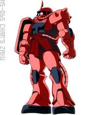

```uml
@startuml
Alice -> Bob: Authentication Request
Bob --> Alice: Authentication Response
 
Alice -> Bob: Another authentication Request
Alice <-- Bob: another authentication Response
@enduml
```

hogehoge

# 実験

